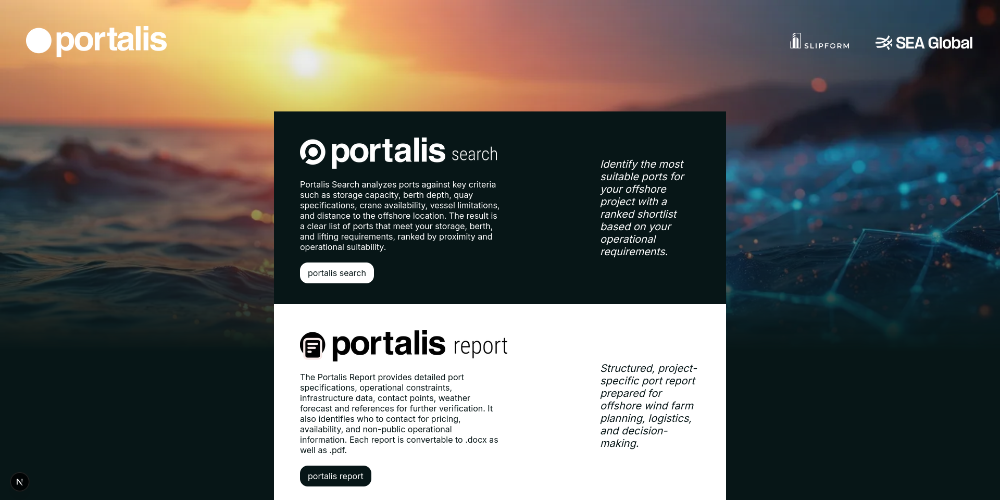
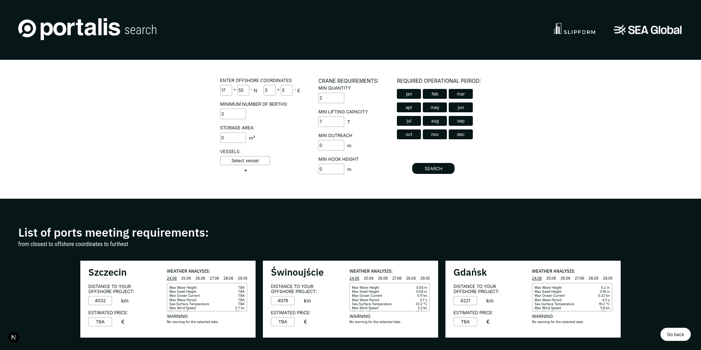
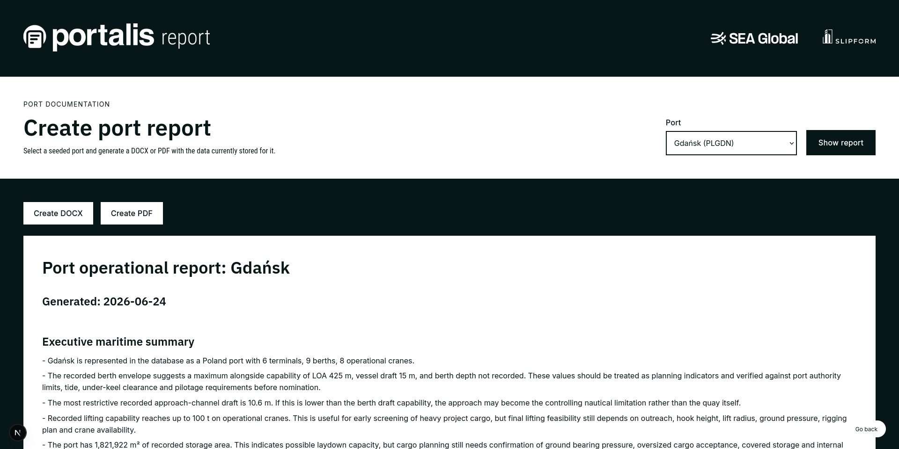

Portalis is a maritime logistics prototype for comparing ports against offshore project requirements. It was created in 24 hours for **IV Kongres Polskie Porty 2030** by **Nadia Zarańska** and **Artur Tomasiak**.

The goal is to make early port selection faster by collecting fragmented port, terminal, berth, crane, vessel, storage, shipowner, weather and operational-condition data in one place, then turning it into a searchable shortlist and exportable port report.

## Why Portalis exists

Choosing a port for an offshore project is difficult because the decision depends on many operational constraints at once:

- berth length, depth, draft, LOA and beam limits,
- storage and laydown capacity,
- crane lifting capacity, outreach and hook height,
- vessel compatibility,
- distance from the offshore location,
- weather and marine warnings,
- access channels, seasonal restrictions and local operational notes,
- non-public information such as availability, pricing and final terminal confirmation.

A traditional feasibility report is time-consuming because relevant information is spread across port pages, terminal operators, shipowners, nautical sources and direct commercial communication. Portalis is an early screening tool: it helps identify which ports are worth investigating first.

## the product

 <tr> <td></td> <td></td> <td></td> </tr> </table>

### Portalis Search

Search compares seeded ports against project requirements and returns a ranked shortlist.

Current filters include:

- offshore coordinates,
- minimum number of matching berths,
- minimum storage area,
- minimum crane count,
- minimum crane lifting capacity,
- minimum crane outreach,
- minimum crane hook height.
- port's operational months

Results are sorted from closest to furthest when offshore coordinates are provided. Distance is calculated with the Haversine formula, so it is a simple point-to-point estimate rather than a navigational route.

Each result also includes weather analysis for the port, using marine and wind forecast data. Estimated price is intentionally left as `TBA` in the prototype because pricing requires direct operator or shipowner confirmation.

### Portalis Report

The report module generates structured documentation for a selected seeded port. It summarizes available database information such as:

- general port data,
- terminals,
- berths,
- storage areas,
- cranes,
- approach channels,
- seasonal or operational conditions,
- related shipowners and contact references.

Reports can be downloaded as **DOCX** or **PDF**.

## Tech stack

- **Next.js**
- **React**
- **TypeScript**
- **SCSS / Sass**
- **better-sqlite3** for local SQLite access
- **Open-Meteo Marine API** and **Open-Meteo Forecast API** for weather and maritime conditions

All engineering decisions were made with the goal of faster R&D. Production would require:

- database migration (or at least re-implementation) - this app opens sqlite directly from route handler or server component.

- change of environments - node.js won't do for scalable data analysis and mathematics.

### installing the project

```bash
git clone https://github.com/ArturTomasiak/portalis.git
cd portalis
npm install
```

### running the project

```bash
npm run build
```

```bash
npm run start
```

Open the local Next.js URL shown in the terminal, usually:

```txt
http://localhost:3000
```